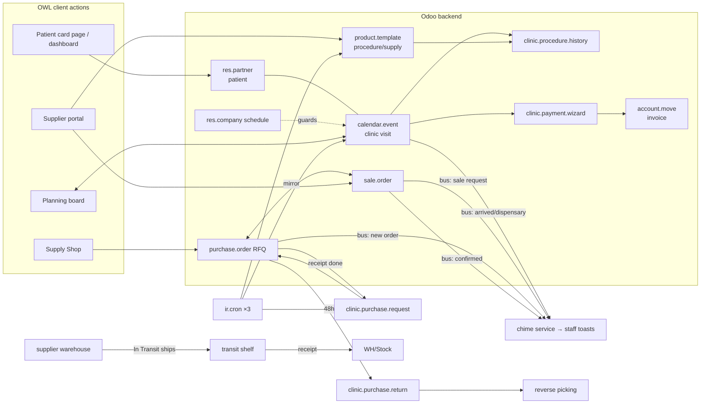

<!-- last-synced: 2026-09-12, commit: 0511206 -->
# Architecture — clinic_patient_card

## Components
| component | where | responsibility |
|---|---|---|
| Patient card | `models/res_partner.py` + `views/res_partner_views.xml` | patient master data (~60 fields in 5 blocks), validations, search, quick actions, "რეალიზაცია" |
| Visit workflow | `models/clinic_appointment.py` (+`clinic_room/appointment_type/clinic_direction`) | clinic_state machine on `calendar.event`, schedule guards, overlap constraint, reserve/dispensary, directions, free-slot search (`clinic_free_slots`), history pushes, notifications |
| Scheduling config | `models/res_company.py` | clinic-wide workdays/hours + room-overlap toggle ("Clinic Schedule" tab) |
| Payment | `wizard/clinic_payment_wizard.py` | procedures → draft invoice (std `account`), mixed cash/terminal split, stamps amounts on the visit |
| Cancel wizard | `wizard/clinic_cancel_wizard.py` | reason-on-Cancel popup |
| Slot finder (client) | `static/src/slot_finder/` (widget + OWL Dialog) | direction/doctor/date-prefiltered free-slot search; pick fills the OPEN visit form without saving (D-16) |
| Warehouse structure | `models/clinic_room.py` + `data/clinic_stock_data.xml` | auto stock.location per room under WH/Stock/Cabinets; Sterilization + 3 write-off locations; Clinic→Stock menu over standard transfers/scrap/orderpoints |
| Purchase requests | `models/clinic_purchase_request.py` (+reject wizard) | 4-source intake → review with recommendations → RFQ per vendor → received on receipt validation (D-15) |
| Global form buttons | `static/src/clinic_form_buttons.xml` | web.FormStatusIndicator extension: labelled Save/Discard, dirty-gated (D-17) |
| Doctor retail requests | `models/sale_order.py` (is_clinic_retail) | doctor drafts a sale → admin approve (auto-invoice) / reject with visible comment |
| Planning board | `static/src/planning/` (OWL, tag `clinic_planning`) | 10-min day grid per dentist, drag-to-size booking, popup visit form, off-hours hatch, Reserve panel, history/cancelled buttons |
| Live alerts | `static/src/clinic_arrived_service.js` | bus subscriber + WebAudio chimes for 6 channels |
| Supply Shop v2.1 | `static/src/shop/` + `models/purchase_order.py` + `models/clinic_shop.py` | clinic buys: banner slots+links, category sections (any-depth subcats), strips, wishlist, ⇄ compare tray, repeat order, localStorage cart persistence → cart → 1 RFQ/vendor + mirror SO |
| Supplier warehouse | `models/clinic_supplier_stock.py` + `wizard/clinic_supplier_move.py` | per-supplier location pair + shelves; count/Apply, Move wizard, ship-at-In-Transit, scoped My Warehouse/Locations/Transfers menus (D-19) |
| Supplier delivery statuses | `models/sale_order.py` (B4) | 5 manual steps on the mirror SO → PO chatter + admin toast |
| Returns | `models/clinic_purchase_return.py` | 48h return pipeline; approve → hand-built reverse picking (D-18) |
| Stock dashboard | `static/src/stock_dashboard/` + `purchase.order.clinic_dashboard_data` | 11 monitoring blocks (items 102-114) |
| Supplier portal | `static/src/supplier_portal/` + `product_template.py` + `sale_order.py` | supplier publishes products (std Inventory base), confirms own SOs |
| Patient dashboards | `static/src/patient_dashboard/`, `static/src/patient_card_page/` | read-only visual pages over res.partner (Health-Care style; Soft-UI handoff) |
| Security | `security/clinic_groups.xml`, `ir.model.access.csv` | 3 roles, ACLs, record rules (doctor scoping GLOBAL rule, supplier own-records) |
| Jobs | `data/clinic_cron.xml` | low-stock daily, dispensary reminders daily, booking report weekly |

## Data flow

| flow | trigger | path |
|---|---|---|
| Booking | slot click/drag on board | OWL → popup form (UTC defaults) → create guards (schedule/overlap) → grid reload onClose |
| Visit cycle | header buttons | booked→…→paid; arrive fires bus+activity to dentist; done pushes history to patient |
| Payment | Register Payment | wizard → std invoice + amounts on visit |
| Procurement | Shop checkout | PO(sent)/vendor + mirror SO → supplier confirms SO → PO auto-confirms → clinic toast; goods via PO receipt (SO lines skip delivery) |
| Dispensary | "+6m" on done visit | reserve entry (+182d, `requested`) → daily cron T-14d admin to-do/toast → ✓ confirm → grid |

## Extension points
- `_inherit`: res.partner, calendar.event, res.users, res.company, product.template,
  purchase.order, sale.order, sale.order.line (stock-rule no-op), stock.picking
  (button_validate hook — request state + deficit-arrival notify).
- View inherits: `base.view_partner_form`, `calendar.view_calendar_event_form`, company & users
  forms; ctx override on `contacts.action_contacts`.
- OWL: 6 client actions in `registry.category("actions")`; 1 service (`clinic_arrived_service`);
  1 view widget (`clinic_slot_finder_btn`); 1 core-template extension (FormStatusIndicator).
- Hooks: `post_init_hook _post_init_grant_admin`; RPC entry points: `clinic_create_rfqs`,
  `clinic_board_config`, `clinic_dentists`, `clinic_free_slots`, `clinic_supplier_*`.
- No controllers, no external APIs (EHR/Form-100 pending — PRD §9).
